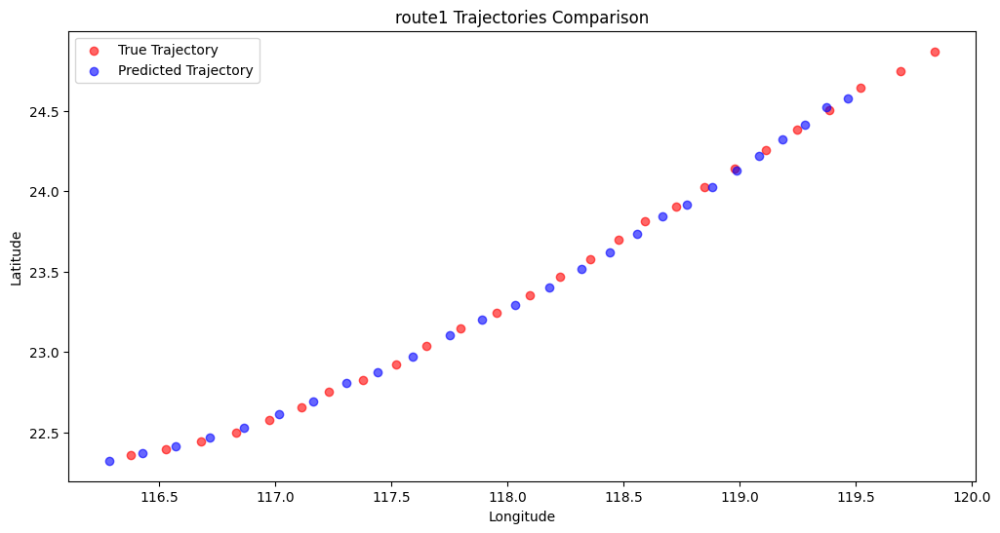
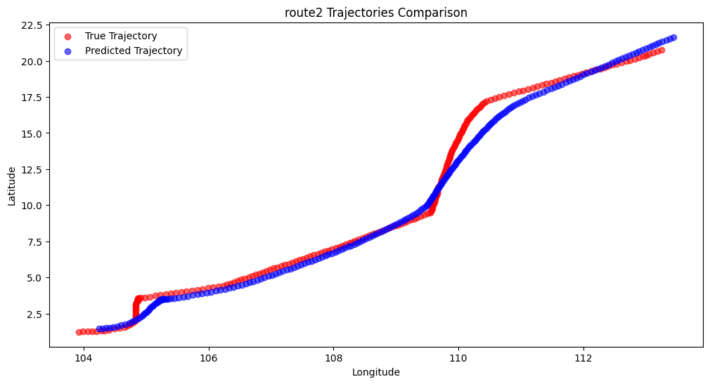
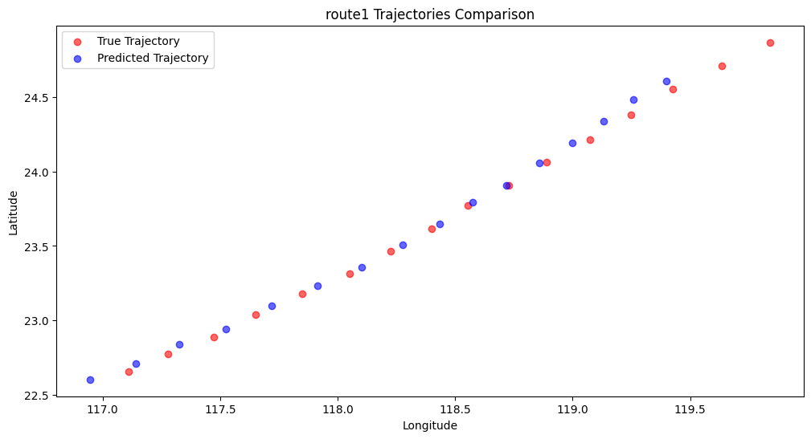

# 🚀 GRUforTrajectories

> Disclaimer:​​ The following content is **an AI-generated README template** only and should not be used for actual experimental content in this project.

## 🧭 Table of Contents
- [Project Overview](#-project-overview)
- [Key Features](#-key-features)
- [Technical Architecture](#-technical-architecture)
- [Installation Guide](#-installation-guide)
- [Quick Start](#-quick-start)
- [Workflow](#-workflow)
- [Performance Metrics](#-performance-metrics)
- [Configuration](#-configuration)
- [Visualization Interface](#-visualization-interface)
- [Contribution Guidelines](#-contribution-guidelines)
- [License](#-license)
- [Support & Contact](#-support--contact)

## 🚩 Project Overview
This project provides a complete solution for temporal trajectory data processing and analysis, including data preprocessing, feature engineering, model training, result evaluation, and visualization modules. The system supports various trajectory data types and can be used for traffic flow prediction, behavior analysis, anomaly detection, and other applications.

## ⚡ Key Features
- **End-to-end processing**: One-stop solution from raw data to visualized results
- **High-performance processing**: Optimized memory management supporting large-scale datasets
- **Modular design**: Flexible replacement of processing components
- **Visualization tools**: Built-in interactive result analysis tools
- **Multi-algorithm support**: Integrated time series prediction models

## 🧱 Technical Architecture

## 📦 安装指南
### 前置要求
- Python 3.8+
- PyTorch 1.10+

### 安装步骤

## 📊 Performance Metrics [Non-experimental Data]
### Model Comparison (RMSE Metric)
| Model Type     | Training Time | Accuracy | Memory Usage |
|----------------|--------------|----------|--------------|
| LSTM           | 2h 15m       | 4.23     | 1.8GB        |
| TCN            | 1h 40m       | 3.98     | 1.2GB        |
| Transformer    | 3h 05m       | **3.72** | 2.4GB        |

### Result Samples
| Timestamp       | Actual | LSTM Pred | TCN Pred | Transformer Pred |
|-----------------|--------|-----------|----------|------------------|
| 2023-01-01 08:00| 42.1   | 41.3      | 42.0     | **41.8**         |
| 2023-01-01 08:05| 45.2   | 44.7      | 44.9     | **44.8**         |
| 2023-01-01 08:10| 48.6   | 47.1      | 48.2     | **48.1**         |

## 📈 Result Visualization

### Selected Experimental Results
We've selected representative results from different routes and test durations:

#### 1. Route 1 - 45-minute Test
  
*Fig: Trajectory prediction vs actual values for Route 1 (45-minute duration)*

#### 2. Route 2 - 30-minute Test
  
*Fig: Prediction accuracy for Route 2 (30-minute duration)*

#### 3. Route 1 - 60-minute Full Test
  
*Fig: Long-term prediction capability for Route 1 (60-minute duration)*

## ⚙️ Configuration
Main configuration files are located in `configs/` directory:

## 📜 License
This project is licensed under the [MIT License](LICENSE)

## 📞 Support & Contact
For questions or suggestions:
- Open [GitHub Issues](https://github.com/your-username/project-name/issues)
- Contact maintainer: contact@example.com
